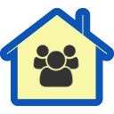

# ioBroker.residents

## residents adapter for ioBroker

Provides an adapter to represent a group of individuals living at your home. The idea is taken from the FHEM RESIDENTS module. 
Each resident can have one of the following states (in ascending order):

* gone - use example: far away, not comming back for days or weeks
* away - use example: away, comming back somewhen today or tomorrow
* around - use example: somewhere in the vicinity, comming back within minutes or hours
* inhouse - use example: working inside the house
* asleep - use example: lying in bed and sleeping
* home - use example: relaxing at home
   
The overall state of the adapter is always the highest state of all residents. The increasing of the states signals the increasing need for heating, light, etc.

## Changelog

### 0.1.0
* (vvitt) initial release for two residents only

### 0.0.1
* (vvitt) copy of template

## License
MIT License

Copyright (c) 2020 Author <vvitt@yahoo.com>

Permission is hereby granted, free of charge, to any person obtaining a copy
of this software and associated documentation files (the "Software"), to deal
in the Software without restriction, including without limitation the rights
to use, copy, modify, merge, publish, distribute, sublicense, and/or sell
copies of the Software, and to permit persons to whom the Software is
furnished to do so, subject to the following conditions:

The above copyright notice and this permission notice shall be included in all
copies or substantial portions of the Software.

THE SOFTWARE IS PROVIDED "AS IS", WITHOUT WARRANTY OF ANY KIND, EXPRESS OR
IMPLIED, INCLUDING BUT NOT LIMITED TO THE WARRANTIES OF MERCHANTABILITY,
FITNESS FOR A PARTICULAR PURPOSE AND NONINFRINGEMENT. IN NO EVENT SHALL THE
AUTHORS OR COPYRIGHT HOLDERS BE LIABLE FOR ANY CLAIM, DAMAGES OR OTHER
LIABILITY, WHETHER IN AN ACTION OF CONTRACT, TORT OR OTHERWISE, ARISING FROM,
OUT OF OR IN CONNECTION WITH THE SOFTWARE OR THE USE OR OTHER DEALINGS IN THE
SOFTWARE.